← [[_index]] | [[05-12 — Mumbai city tour]] →

# 05-11 — Arrival in Mumbai

## Schedule

```mermaid
gantt
    title 05-11 — Arrival in Mumbai
    dateFormat HH:mm
    axisFormat %H:%M

    section Day
    Flight lands BOM  :crit, 09:35, 11:00
    Transfer to hotel :crit, 11:00, 12:30
```

- **09:35** — Delta 5945 lands at Mumbai (BOM)
- **11:00** — Private group transfer from airport to hotel
    - Host: Gagan Anand (look for Terry School of Business sign at exit)
    - Group orientation during bus ride
- **12:30** — Approximate arrival to hotel
- *Check-in at President Mumbai – IHCL SeleQtions (rooms ready 15:00; luggage hold available before)*
- *Walking orientation around the hotel*
- *Free time for lunch and dinner*

## Notes
**Stepping off the plane:** the biggest shock was the *heat* — like walking into a sauna.

**The bus ride to the hotel:** mesmerizing. Watched the traffic flow out the window. Constant honking — BEEP BEEP HONK HONK — they seem to honk for fun, not anger. Tall but run-down buildings line the streets.

**Surprise that cut against expectations:** the air felt *clean and clear*, not the heavy smog so often portrayed online. (Good "expectation vs. reality" beat for the goals prompt.)

**Pre-trip fears, day 1 status:** none of them (getting sick, racism toward East Asians, language barrier) were confirmed *or* denied yet — too early. Just noting they hadn't materialized.

**Evening:** group hung out by the hotel pool and tried Kingfisher (Indian beer). First easy group-bonding moment.

**The cat that announced the trip (McDonald's, 2nd floor).** Walked to McDonald's; while waiting on food, a **cat fell out of the ceiling tile** onto a guy's **meal and laptop**, tried to **run up the wall onto the light fixture**, failed, and **sprinted out the door.** My exact thought: *"this country is not real, bro."* ⟶ **Top opener candidate:** captures "the secondhand India was wrong — you have to see it" + order-within-chaos in one absurd scene.

First impressions: the city is *very* busy. A mix of run-down buildings and modern architecture, but mostly older. Street stalls and small shops line the roads everywhere; striking that for many people a tiny stall is the whole livelihood.

Did a walking tour around the local neighborhood; saw the Taj Mahal Palace hotel (the Taj Mumbai).

How people move through the city is fascinating: essentially no enforced traffic laws. Pedestrians cross whenever they want and somehow don't get hit. (Hold this — links to the cultural-comparison theme of order/informality vs. East Asia.)

## Learned today
- QR codes used everywhere as payment (UPI). 
- Conversion rate ≈ 1 INR = 0.01 USD. "1 lac" = 100,000 rupees.

## People met
- Gagan Anand (group host / transfer)

## Sparked
- The informal economy is enormous and visible. Entrepreneurship at the street-stall level vs. the legacy-capital story we later see at Keerthi — two ends of the mobility spectrum. (Cultural-comparison + sector-analysis thread.)
