← [[05-11 — Arrival in Mumbai]] | [[05-13 — Elephanta Caves]] →

# 05-12 — Mumbai city tour

## Schedule

```mermaid
gantt
    title 05-12 — Mumbai city tour
    dateFormat HH:mm
    axisFormat %H:%M

    section Morning
    Breakfast        :07:00, 10:00
    Mumbai city tour :10:15, 13:15

    section Afternoon
    Free lunch       :13:15, 14:30

    section Evening
    Bus to dinner    :crit, 19:15, 19:30
    Welcome dinner   :19:30, 21:00
```

- **07:00** — Breakfast at hotel (until 10:00)
- **10:15** — Bus departs hotel (lobby 10:05); [[Mumbai]] city tour
    - Marine Drive
    - Gateway of India
- **13:15** — Free time for lunch
- **14:30** — Approximate return to hotel
- *Free afternoon*
- **19:15** — Bus departs hotel for dinner (lobby 19:05)
- **19:30** — Welcome dinner at [Khyber Restaurant](https://khyberrestaurant.com)
- **21:00** — Approximate return to hotel

## Notes
**British colonial legacy, everywhere in the architecture:** the Taj Mahal Palace hotel, Victoria Terminus (CST) train station. History sits physically on top of the modern city. (Thread: importance of history/colonial inheritance in Indian urban identity.)

**Saw cricket** being played in a field — the British sporting inheritance, still the national obsession.

**Street food:** tried vada (potato patty in a bun — vada pav). Also anjeer (fig) flavored "Naturals" ice cream.

**Dinner observation that held true the whole trip:** waiters *serve the dishes onto your plate for you* rather than the American grab-it-yourself, family-style approach. A more attentive, hierarchical service culture. (Thread: hospitality / service norms — cultural comparison sub-point.)

**Food safety:** OK today, no issues.

## People met
- 

## Sparked
- Colonial architecture as living infrastructure — what does it mean that the icons of the city (Taj hotel, CST) are British-built? Pride + complicated history.
- Service culture (plating for the guest) as a window into hierarchy/hospitality vs. US individualism.
