← [[05-12 — Mumbai city tour]] | [[05-14 — HDFC Capital + Classroom]] →

# 05-13 — Elephanta Caves + evening food tour

> Title undersells it: the day was Elephanta (AM) → Fabindia shopping (PM) → **guided street-food tour (evening)**. The food tour is the big reflection material.

## Schedule

```mermaid
gantt
    title 05-13 — Elephanta Caves
    dateFormat HH:mm
    axisFormat %H:%M

    section Morning
    Bus to Gateway     :crit, 08:00, 08:15
    Ferry to Elephanta :08:15, 09:15
    Toy train          :09:15, 10:15
    Caves visit        :10:15, 11:15
    Boat back          :11:15, 13:00

    section Afternoon
    Group lunch        :13:00, 14:30
```

- *Breakfast at hotel*
- **08:00** — Bus departs hotel (lobby 07:50); drive to Gateway of India
- **08:15** — Ferry to Elephanta Island
- **09:15** — Toy train to caves
- **10:15** — Elephanta Caves visit
    - UNESCO World Heritage site
    - ~120 steep steps; Trimurti sculpture
- **11:15** — Boat back to Gateway of India
- **13:00** — Group lunch at [Copper Chimney](https://copperchimney.in)
- **14:30** — Approximate return to hotel
- *Free time to explore; free time for dinner*

## Notes
**Morning — ferry + caves.** The ferry was a small boat that would *never* pass US safety regulation: had to jump from the dock onto the boat across rocky, moving water. (Thread: risk tolerance / regulatory difference vs. US.) Group played "Imposter" on the ride over — genuinely fun, good bonding. The caves themselves were alright; learned some history. Standout: the practice where, when men went to war and died, the women left behind would jump into pits of fire (sati). Also saw monkeys.

**Afternoon — Fabindia.** Shopped; me and the other 3 guys on the trip each bought a kurta.

**Evening — guided street-food tour. (Big one.)**

*Train-riding ritual* (super fun, participated): you don't board a stopped train — you wait until it *starts moving* and hop on; while moving you hang out the open door even if the car is empty; to get off you hop *before* it stops. A whole informal-but-universal cultural choreography.

*The food, and the hygiene paradox:* tried pani puri, dahi puri, and bhel at a small roadside table. The vendor wore no gloves and had his bare feet out. There were signs reading **"MADE WITH BISLERI"** (bottled water) signaling safety — yet he was still dipping his bare hand into the water to make the food. **Hygiene theater:** the *signal* of safety (branded bottled water) layered over an unsafe practice. Strongly suspect this is what got most of the group sick.

Also tried: dosa, a small thali, street chai, and **paan** (betel leaf) — especially memorable for its sharp, fresh taste. Put the whole thing in my mouth, took a huge CHOMP, then spit it out. That vendor was barefoot, sitting cross-legged, feet ~6 inches from the food.

*My body during the tour:* got very uncomfortable from the volume of bread/carbs plus the heat. By the end I was taking only small nibbles and drinking tons of (bottled) water.

**Aftermath — the fear materializes (for the group).** Next day most of the group had stomach issues; one girl threw up overnight and spent the entire next day in bed, sitting out of class. I had slight stomach issues the next day that cleared the day after. Bought Pudin Hara and Pepto chews. (Goals prompt: my "I'll get sick" fear *partly* came true — but the bigger lesson was about which risks were real vs. imagined.)

## People met
- The 3 other guys on the trip (kurta crew)

## Sparked
- **Hygiene theater** ("MADE WITH BISLERI" + bare hands) — the gap between the *signal* of safety and the *practice*. Possible cultural-comparison anchor on food safety / trust / regulation.
- Train-hopping as informal-norm choreography — links to North's "informal norms + enforcement" framework from Class 1.
- Sati history — heavy, but a marker of how present history/religion is at these sites.
- High risk tolerance (the ferry) vs. US — recurring thread.
