← [[05-13 — Elephanta Caves]] | [[05-15 — Dabbawalas + ECGC]] →

# 05-14 — HDFC Capital + Classroom

## Schedule

```mermaid
gantt
    title 05-14 — HDFC Capital + Classroom
    dateFormat HH:mm
    axisFormat %H:%M

    section Morning
    Classroom time  :09:00, 13:00

    section Afternoon
    Free lunch      :13:00, 14:30
    Bus to HDFC     :crit, 14:30, 15:00
    HDFC Capital    :15:00, 17:00
    Return to hotel :crit, 17:00, 17:30
```

- *Breakfast at hotel*
- **09:00** — Classroom time (4 hr; tea/coffee provided)
- **13:00** — Free time for lunch
- **14:30** — Bus departs hotel (lobby 14:20)
- **15:00** — [[HDFC Capital Advisors]] visit — real estate PE, HDFC Ltd. subsidiary
- **17:30** — Approximate return to hotel
- *Free time for dinner*

## Notes
**Morning class (first real session).**
- Covered **Hofstede's cultural dimensions** in Indian business vs. US — focus on *power distance, individualism, uncertainty avoidance, long/short-term orientation*. (Didn't take great notes here; reconstruct from memory + readings.)
- I **presented on the Mumbai Dabbawalas** to prep the class for the next day's visit. (Deck: `India Dabbawala Presentation.pptx`.) Most striking learning: instead of modern tech / SaaS, they run on a **color-coded letter-and-number system** because much of the older workforce is illiterate. Low-tech coding scheme outperforms apps for this context.

**Afternoon — HDFC Capital (economic primer, not a company study).**
HDFC = India's largest private bank; we visited **HDFC Capital**, its real-estate fund-manager subsidiary that raises third-party funds for housing development. The visit's real purpose was an economic primer for the whole course.

**KEY TAKEAWAY — tech + cultural "enablers" accelerating India toward a self-sustaining economy:**
- *Tech enablers:* government **proof-of-identity system (Aadhaar)** linking every Indian to a phone number + cheap data + cheap smartphones → **UPI**. UPI democratizes finance and lets the previously *unbanked* transfer money (≈ Cash App / Venmo in the US).
- *Cultural enablers:* a strong ethos of **self-reliance** and **frugal workarounds (jugaad)** for industrial systems; a **growing startup culture** (we visit a startup incubator in week 2 — tie in later).

**SURPRISING — how *young* India's financial-product market is:**
- Until **2000, India had only ONE life insurance company** (LIC monopoly). US life insurance is 100+ years old → huge gap in adoption of "financial products." ⟶ *[APA: verify — IRDA opened the sector in 2000.]*
- **Mortgages** only popularized in roughly the **last ~25 years**.
- *Why:* the **regulatory/legal infrastructure** isn't built for these vehicles. Courts have **thousands of backlogged cases, wait times measured in years**, which makes complex lending terms hard to enforce. ⟶ *[APA: verify Indian judicial backlog figure.]* (Ties directly to North's institutions framework — weak *enforcement* of formal rules.)

**Evening.** Dinner at Trishna (lobster, good). Earlier I'd bought a **pashmina scarf ("pash")** at Fabindia and wore it after dinner while waiting on an Uber. A young girl panhandling pointed at my scarf and kept asking **"you girl?"** — funny, and a small marker that *scarf culture here reads as feminine*. (Minor dress/gender-norm note.)

## People met
- HDFC Capital hosts (names TBD)

## Sparked
1. Government's hand in **UPI + Aadhaar** echoes the **China playbook** (state-built digital rails). Curious how heavy state influence persists as India develops. (Connects to North + the "state's role in developing markets" line from Class 2.)
2. Fact drop: **~40% of new college grads are "unemployable."** Cheating through school, or curriculum/skills mismatch? ⟶ *[APA: verify — India employability surveys.]*
3. The US already has Cash App / Venmo — why didn't that model explode here the way UPI did? Likely because the West has *long-standing banks* and near-universal bank accounts (a bank account beats a purely transactional wallet for saving/investing). And why doesn't India *export* UPI to other developing markets (Thailand, Indonesia, Latin America)? Maybe they already have their own rails. (Open question — could enrich the fintech angle.)

## Essay-style note
Lean **show-don't-tell**: surface the goals/fears themes through stories (the scarf, the food tour, the MD), not by stating them outright.
