← [[05-14 — HDFC Capital + Classroom]] | [[05-16 — Mumbai → Hyderabad]] →

# 05-15 — Dabbawalas + ECGC

## Schedule

```mermaid
gantt
    title 05-15 — Dabbawalas + ECGC
    dateFormat HH:mm
    axisFormat %H:%M

    section Morning
    Bus to Dabbawalas :crit, 10:15, 11:50
    Dabbawalas visit  :11:50, 13:45

    section Afternoon
    Free lunch        :13:45, 15:00
    ECGC visit        :15:00, 16:30
```

- *Breakfast at hotel*
- **10:15** — Bus departs hotel (lobby 10:15)
- **11:50** — [[Mumbai Dabbawalas]] operation visit (1 hr 30 min)
- **13:45** — Free time for lunch
- **15:00** — [[ECGC]] visit (Govt of India, est. 1957; Ministry of Commerce & Industry)
    - Manual lists 2hr but return time 16:30 implies 1.5h — verify on site
- **16:30** — Approximate return to hotel
- *Free time for dinner*

## Notes
*(filled during/after)*

## Notes
**Dabbawalas (seeing it live vs. my presentation).**
- *Biggest surprise:* most dabbas are **no longer the iconic gray tiffins** — they're now ordinary lunchboxes with the coding written **directly on the box**. Most are packed by the worker's **family (usually mother or wife)**; some "tiffin companies" make fast-food-style dabbas for pickup. The romantic image is already half-gone.
- *Watching the system work:* arrived to lunchboxes in piles all over the ground. Within the ~20 minutes we were there, everything was **sorted and loaded onto bikes/carriers**; as we left, the dabbawalas were rolling off onto delivery routes. The choreography is real.
- *Tourism as a side-business:* a Chinese YouTuber was there vlogging. They offer a **"full tour" where you follow a single lunchbox** from home to delivery — a potential extra revenue stream. Our guide spoke polished English and had clearly run the tour many times.
- **MAIN TAKEAWAY:** culture and tradition are *deeply embedded* in the operation. They don't need modern tech because the **existing system already works so well** (North's Q2 — informal norms + social enforcement substituting for formal IT systems). Reinforces, doesn't complicate, the framework — but the *fading gray tiffin* is the small tension worth noting.

**ECGC (Export Credit Guarantee Corporation).**
- A government **export-credit agency**: provides **payment insurance** to companies exporting *out* of India. "A guarantee of compensation for specific incidents in return for a premium." Protects against loss from missed/late payment; hedges **commercial and political risk**.
- *Structure:* **short-term** cover (payment periods < 1 yr — most physical goods) vs. **long-term** (1–15 yrs — infrastructure, overseas construction).
- *Worked example:* India builds an airport in a poorer country (e.g., Zimbabwe), funded by an Indian bank. If the local government defaults, ECGC insures the developer and **India can take control of the airport**. ⟶ a tool of **economic statecraft / soft power** abroad.
- **MAIN TAKEAWAY:** the state actively **subsidizes/insures exports** to push goods and services outward; many countries run a similar state-backed export agency. (Another data point for "the state has a role in helping a developing market thrive.") Not a dud, but drier than the Dabbawalas.

**Evening — nightlife note.** Went to the bar/club downstairs in the hotel. Two observations: (1) nightlife doesn't get active until ~**1:45–2:00 am**; (2) most high-end hospitality (fancy restaurants, bars, clubs) is **inside hotels**, vs. more developed cities (NYC, DC, Taipei, Tokyo) where nightlife is **standalone venues**. (Thread: why hotel-centric? Safety, alcohol licensing, class/access, real-estate? — cultural-comparison sub-point on urban social life.)

## People met
- Dabbawala tour guide (well-practiced English)

## Sparked
- The **fading gray tiffin** — the most-photographed symbol of the system is disappearing while the *system* persists. Tradition lives in the *method*, not the object.
- ECGC as **soft power**: export insurance as a lever for Indian influence in developing markets (the airport example). Connects to the China-playbook thread.
