← [[05-15 — Dabbawalas + ECGC]] | [[05-17 — Hyderabad city tour]] →

# 05-16 — Mumbai → Hyderabad

## Schedule

```mermaid
gantt
    title 05-16 — Mumbai → Hyderabad
    dateFormat HH:mm
    axisFormat %H:%M

    section Morning
    Breakfast and checkout :07:00, 08:30
    Transfer to airport    :crit, 08:30, 11:45
    IndiGo 6E 5178         :crit, 11:45, 13:20

    section Afternoon
    Transfer to Taj Deccan :crit, 13:20, 15:00
    Check-in               :15:00, 15:30
```

- **07:00** — Breakfast at hotel
- *Check out from President Mumbai – IHCL SeleQtions*
- **08:30** — Private group transfer to airport (lobby 08:10)
- **11:45** — IndiGo 6E 5178 departs Mumbai (BOM) Terminal 1 *(IndiGo domestic uses BOM T1, not T2 — verify terminal with ticket)*
- **13:20** — Arrives Rajiv Gandhi International Airport ([[Hyderabad]] / HYD)
- **14:00** — Arrival in Hyderabad and transfer to hotel
- **15:00** — Check-in at Taj Deccan, Hyderabad
- *Walking orientation*
- *Free time for lunch and dinner*

## Notes
**Travel day (Mumbai → Hyderabad), but real cultural material.**

**Hospitality is on another level.** Played tennis at the hotel; while waiting for others, the **tennis attendant hit with me** — and did so on other days too. Once I showed up and he was already rallying with a different guest. In the US I've *never* seen an employee play with guests. (Thread: service-as-genuine-hospitality, not just transaction.)

**Evening — rooftop bar (again, above a hotel → reinforces the hotel-centric nightlife pattern).**
- Crossed an insane **6-lane street with no crosswalk** to get there; crossed it again, drunk, on the way back. Saw a guy **riding a camel** on the walk. Discovered **Kingfisher TOWERs**.
- A group member **cut his hand**; we treated it in the hotel bathroom with no formal first-aid staff, monitored it over the following days, and it healed well. (Marker of informal/DIY problem-solving + thinner safety infrastructure.)
- **Service ethos, sharpest observation yet:** as obvious Americans we stand out, and staff treat us like *"in front of me is a problem I need to solve."* We can ask for almost anything and they make it happen — wanted music (it was quiet) and they put it on; wanted tables pushed together and a place to smoke, and they obliged. A professor framed it in class: there isn't a strong **"No" culture** in Indian service, it's **"I'll do my best."**
  - **Firsthand corroboration (use this):** I saw the same thing working at **KPMG**, sitting in on meetings with the **offshore India team**. Same yes-and, accommodate-the-ask posture. ⟶ This gives me real two-culture authority for the cultural-comparison prompt, not just tourist observation.

## People met
- Hotel tennis attendant (the unexpected hitting partner)

## Sparked
- Why is the service posture so different? Power distance + a hospitality tradition (*atithi devo bhava*, "guest is god") + labor abundance. Tie to Hofstede (power distance) and my KPMG experience.
- Thinner formal safety net (no first-aid staff) vs. ever-present human helpfulness — a trade I keep noticing.
