← [[05-17 — Hyderabad city tour]] | [[05-19 — Classroom day]] →

# 05-18 — Manufacturing + cooking class

## Schedule

```mermaid
gantt
    title 05-18 — Manufacturing + cooking class
    dateFormat HH:mm
    axisFormat %H:%M

    section Morning
    Manufacturing visit :10:00, 13:00

    section Evening
    Cooking and dinner  :18:30, 21:00
```

- *Breakfast at hotel*
- **09:30** — Bus departs hotel (lobby 09:20)
- **10:00** — Manufacturing in India session (**tentative** — possible hosts: [[Granules India]], [[Cyient]])
- **13:00** — Approximate return to hotel
- *Free time for lunch and afternoon*
- **18:30** — Hands-on cooking & dinner at private home (host: Ms. Indira)
    - Hyderabadi biryani, dum cooking, served on banana leaves
- **21:00** — Approximate return to hotel

## Notes
**Morning — [[Keerthi Holdings]] (the framework anchor).** Full detail lives in the company note: rigid/flex PCB manufacturer, 100% Export-Oriented Unit, family-holding structure, the MD/power-distance moment, Make-in-India CAPEX subsidy, talent constraints, and my Rocket Lab comparison. See [[Keerthi Holdings]].

**Evening — cooking class at Ms. Indira's home.** Invited into a family's home; learned to make **Hyderabadi biryani** (dum cooking, banana leaves). Really fun, genuinely yummy, warm memory.
- **Multi-generational household, observed directly (cultural-comparison evidence):** a family of **7–8 people** cooked together — **cousins, brothers, and siblings all under one roof** — and they run a **YouTube channel** documenting their cooking. *Tradition + modern hustle in the same kitchen.* (Pairs with the 4-generations BMW-driver story on [[05-25 — Delhi → Frankfurt (personal)]].)

## People met
- The MD of Keerthi (entered late; addressed Prof. Srini, not us)
- Ms. Indira (cooking-class host)

## Sparked
- See [[Keerthi Holdings]] for the China +1 / competition open question and the family-holding-vs-US-PE thread.
- **Favorite-part realization:** the single best part of the trip wasn't any one visit — it was **spending time with the UGA group**, hanging out, and the adventures that spun out of that (the rooftop-bar street crossings, rickshaw runs, etc.). Possible **essay opener:** *how hard it is to name one favorite moment* → land on the people.
