← [[05-19 — Classroom day]] | [[05-21 — Hyderabad → New Delhi]] →

# 05-20 — DVC + Microsoft

## Schedule

```mermaid
gantt
    title 05-20 — DVC + Microsoft
    dateFormat HH:mm
    axisFormat %H:%M

    section Morning
    Bus to DVC      :crit, 09:10, 10:00
    DVC visit       :10:00, 12:00

    section Afternoon
    Free lunch      :12:00, 14:00
    Microsoft visit :14:00, 17:00
    Return to hotel :crit, 17:00, 18:00
```

- *Breakfast at hotel*
- **09:10** — Bus departs hotel (lobby 09:00)
- **10:00** — [[Dallas Venture Capital]] (2 hr) — cross-border VC, B2B SaaS / AI / enterprise
- **12:00** — Free time for lunch
- **14:00** — [[Microsoft Hyderabad]] campus visit (3 hr) — Azure, M365, AI/R&D
- **18:00** — Approximate return to hotel
- *Free time for dinner*

## Notes
> Company detail lives in [[Dallas Venture Capital]], [[T-Hub]], and [[Microsoft Hyderabad]]. This note holds the day's arc + evening.

**Morning — [[Dallas Venture Capital]]** (cross-border VC). The partner then **spontaneously called a T-Hub contact and walked us across the street** for a **surprise visit to [[T-Hub]]** (startup incubator). Together these are the **"new entrepreneurship" counter-image** to Keerthi's old-family-capital model — but with a twist (see DVC note: the founders are US-tech returnees, a *different* elite, not wealth-independent).

**Afternoon — [[Microsoft Hyderabad]]**, two speakers (one strong PM, one weak cloud architect — detail in the note). Good follow-up **AI-stack conversation with Dr. Srini** afterward; he sent a **whitepaper** ⚠️ *(not found in uploads — re-attach if I should fold it in)*. Key takeaway: **companies need to post-train models to their own need/style** so agents truly understand each business. *(Idle musing: startup idea? no idea how to build it.)*

**Evening.** Dinner at **Dakshin (ITC Kakatiya)** — traditional **thali**, very good. Then **"Forget Me Not" shisha, round 2**, larger group. Another **hospitality echo** (cf. Kingfisher-Towers rooftop, 5/16): during a cricket ad they threw on a **Playboi Carti** track we were vibing to; when the game killed the mood, they just **handed us the YouTube remote for the rest of the night.** The "I'll do my best" service ethos, again.

## People met
- DVC partner (US-tech-returnee founder)
- T-Hub guide
- 2 Microsoft speakers
- Dr. Srini (AI-stack chat)

## Sparked
- DVC/T-Hub vs Keerthi = the spine of the sector/mobility argument: **old family capital vs new (but still elite) entrepreneurship.**
- Microsoft's regional-advertising point (keep core global, adapt locally) = good **cultural-comparison** color on India's internal diversity.
- Open Q (Microsoft talk 1): for *greenfield* AI processes with no pre-AI baseline, how do you measure value? Unconvinced by the answer.
