← [[05-20 — DVC + Microsoft]] | [[05-22 — SECI + Nokia]] →

# 05-21 — Hyderabad → New Delhi

## Schedule

```mermaid
gantt
    title 05-21 — Hyderabad → New Delhi
    dateFormat HH:mm
    axisFormat %H:%M

    section Morning
    Breakfast and checkout  :07:00, 08:30
    Transfer to airport     :crit, 08:30, 11:35
    IndiGo 6E 6202          :crit, 11:35, 13:55

    section Afternoon
    Transfer to Le Meridien :crit, 13:55, 16:00
    Check-in                :16:00, 16:30
    Walking tour            :16:30, 18:30
```

- **07:00** — Breakfast at hotel
- *Check out from Taj Deccan*
- **08:30** — Private group transfer to airport
- **11:35** — IndiGo 6E 6202 departs Rajiv Gandhi International Airport (HYD)
- **13:55** — Arrives Indira Gandhi International Airport ([[New Delhi]] / DEL) Terminal 1
- **15:00** — Arrival in Delhi and transfer to hotel
- **16:00** — Check-in at Le Meridien Hotel
- **16:30** — Neighborhood walking tour (ATM, grocery, pharmacy, Metro)
- *Free time for dinner*

## Notes
**Travel day (Hyderabad → New Delhi).**
- Dinner at **Indian Accent** — *alleged #1 restaurant in India.* Solid, but **very non-traditional / European-style** plating and technique. *Honest verdict: the **thali** the night before (Dakshin) was better.* (Small food-culture note: the "best" restaurant leaned Western fine-dining, while the most satisfying meals were the traditional ones — says something about what authenticity I valued.)

## People met
- 

## Sparked
- The "#1 restaurant" being Europeanized vs. the traditional thali winning for me — a tiny data point on authenticity vs. prestige in food.
