← [[05-21 — Hyderabad → New Delhi]] | [[05-23 — Taj Mahal day trip]] →

# 05-22 — SECI + Nokia

## Schedule

```mermaid
gantt
    title 05-22 — SECI + Nokia
    dateFormat HH:mm
    axisFormat %H:%M

    section Morning
    SECI visit (TBC) :09:30, 12:00

    section Afternoon
    Free lunch       :12:00, 14:30
    Bus to Nokia     :crit, 14:30, 15:00
    Nokia visit      :15:00, 17:00
    Return to hotel  :crit, 17:00, 17:30
```

> **TBC:** SECI bus departure time and visit duration not specified in manual.

- *Breakfast at hotel*
- *Bus departs hotel (time TBC)*
- *[[SECI]] visit — Solar Energy Corporation of India (Ministry of New & Renewable Energy)*
- *Free time for lunch*
- **14:30** — Bus departs hotel
- **15:00** — [[Nokia]] telecom network session (2 hr)
    - Speaker: Anand Palvarshney (Head of Network Automation APAC)
- **17:30** — Approximate return to hotel
- *Free time for dinner*

## Notes
> Company detail in [[Ornate Solar]] (AM) and [[Nokia]] (PM). **Reminder:** the morning was **Ornate Solar**, NOT [[SECI]] (last-minute swap).

**Morning — [[Ornate Solar]] (one of the best visits of the trip).** Mostly a **TAM/market-sizing of Indian renewables**, not a company pitch. The **speaker was among the best of the whole trip** (other top contender: the 20+ yr Microsoft PM).

**Afternoon — [[Nokia]] (weak).** Telecom-infrastructure overview; fell flat. The "robotics posters but 'no, we're not in robotics'" moment summed it up.

## People met
- Ornate Solar speaker (trip-best tier)
- Nokia hosts

## Sparked
- **Speaker quality** turned out to be the single biggest driver of how much I got from a visit (Ornate Solar & MS-PM excellent; Nokia & MS-talk-2 poor). A real "ways of seeing" lesson about how knowledge transfers.
- Solar's huge TAM vs. its real adoption barriers = a genuine tension (see Ornate note).
