← [[05-22 — SECI + Nokia]] | [[05-24 — Program ends; personal night at Leela Palace]] →

# 05-23 — Taj Mahal day trip

## Schedule

```mermaid
gantt
    title 05-23 — Taj Mahal day trip
    dateFormat HH:mm
    axisFormat %H:%M

    section Early morning
    Bus to Agra     :crit, 02:00, 06:30

    section Morning
    Taj Mahal       :06:30, 09:00
    Light breakfast :09:00, 12:00

    section Afternoon
    Agra Fort       :12:00, 14:00
    Group lunch     :14:00, 15:15
    Bus to hotel    :crit, 15:15, 19:30
```

> **Pack the night before.** 02:00 lobby ready 01:55. ~17.5h day.

- *Boxed breakfast (provided)*
- **02:00** — Bus departs hotel (lobby 01:55)
- **06:30** — Sunrise visit to [[Taj Mahal]] — UNESCO; Yamuna River, Agra
- **09:00** — Light breakfast stop
- **12:00** — Agra Fort visit
    - Red sandstone; Delhi Gate, Amar Singh Gate
    - Shah Jahan's prison room
- **14:00** — Group lunch
- **15:15** — Bus departs Agra to hotel
- **19:30** — Approximate arrival to hotel
- *Free time for dinner*

## Notes
**Taj Mahal (Agra day trip) — favorite-part contender.**
- Brutal logistics: bed ~11:30pm, **up at 1:15am** for the bus; arrived Agra shortly after sunrise.
- **First impression: wow.** Genuinely impressive in person; *"most beautiful piece of Islamic architecture"* makes sense standing there.
- **The story is what stuck:** Shah Jahan built it (with **slave labor**) for his wife **so the world would have something to remember her by.** A **mosque sits on the left**; to preserve **symmetry** he built an **identical mirror building on the right that was never used.**
- **The irony I loved:** Shah Jahan was later **buried next to his wife by his daughters**, which **offset the very symmetry** he'd obsessed over — his own tomb defied the purpose of his design.
- **Recurring OPEN QUESTION (from 5/17):** Islamic heritage is central to India's history, yet modern India is majority Hindu. **Do Hindus "claim" the Taj, or is it held as Islamic?** The trip kept surfacing this; I still don't have the answer (and shouldn't pretend to).

**Agra Red Fort.** Found the **masjid** inside; stepped onto its **balcony** and — *"wow, it's quiet."* The **noise pollution from outside just vanished**; the space was silent. **Acoustic engineering, centuries ago** — quietly (literally) one of the most impressive things I saw.

**Back in Delhi — Old Delhi walk with [[Contacts|Gagan]]** (our guide who traveled with us the whole 2 weeks; **Delhi native**, deeply knowledgeable — a relationship highlight, not just logistics). **The market was organized by commodity:** all clothing in one section, **jewelry on one street**, another section for dried fruits / nuts / spices. **Order within the chaos** — a recurring theme of the whole trip.

## People met
- Gagan (guide, 2 weeks with us; Delhi native)

## Sparked
- The **symmetry → broken symmetry** of the Taj = a ready-made metaphor (best-laid plans; the gap between intention and outcome).
- **Order-within-chaos** (commodity-segmented bazaar; traffic; dabbawalas) — a through-line worth naming in the essay.
- The Islamic-heritage / Hindu-majority question — keep as honest open question.
