← [[05-23 — Taj Mahal day trip]] | [[05-25 — Delhi → Frankfurt (personal)]] →

# 05-24 — Program ends; personal night at Leela Palace

## Schedule

```mermaid
gantt
    title 05-24 — Program ends; personal night
    dateFormat HH:mm
    axisFormat %H:%M

    section Morning
    Debrief session     :10:00, 13:00

    section Afternoon
    Free lunch          :13:00, 15:45
    Bus to dinner       :crit, 15:45, 16:00
    Farewell dinner     :16:00, 20:00

    section Evening
    Transfer to Leela   :crit, 20:00, 21:00
```

> Group goes to airport from dinner; I peel off to The Leela Palace for the night. Hotel handles tomorrow's airport transfer.

- *Breakfast at hotel*
- *Check out by 10:00 (note: manual lists Le Meridien vs Metropolitan as conflicting)*
- **10:00** — Debrief session (3 hr; hotel meeting room)
- **13:00** — Free time for lunch
- **15:45** — Bus departs hotel (lobby 15:35)
- **16:00** — Farewell dinner with group (restaurant TBC)
- **~20:00** — Group departs to airport; I head to The Leela Palace, New Delhi
- *Check in at The Leela Palace; airport transfer arranged for tomorrow morning*

## Notes
**Morning class — Scavenger Hunt presentations (great way to end).** Presented our finds. The hunt was a **26-item cultural-immersion checklist** we filled over 2 weeks → see [[Scavenger Hunt — cultural immersion checklist]]. Maps almost 1:1 onto the **skills / ways-of-seeing** prompt: by the end I was *reading* the city (informal economy, UPI in the wild, colonial remnants, order-in-chaos) instead of just looking at it.

**Early dinner**, then the main group left for the airport — not memorable.

**Extra night — The Leela Palace.** I'd booked it; went with **Drew and Alex** (their 2am flights) after dinner. **Palace was insane — one of the coolest hotels I've ever been in.** Sushi at **Megu** inside.

## People met
- Drew, Alex (last-night crew)

## Sparked
- The scavenger hunt is the **cleanest scaffold for the skills prompt** — concrete, photographed, specific (exactly what the rubric rewards).
