← [[05-24 — Program ends; personal night at Leela Palace]] | [[_index]] →

# 05-25 — Delhi → Frankfurt (personal)

## Schedule

```mermaid
gantt
    title 05-25 — Delhi → Frankfurt
    dateFormat HH:mm
    axisFormat %H:%M

    section Morning
    Transfer to DEL :crit, 09:00, 10:30
    AI 2029 DEL-FRA :crit, 12:20, 19:35
```

> AI 2029 times per public sources (some sources show 12:10/19:00). Verify with ticket. Frankfurt arrival is local CET; flight is ~10h 50m total.

- *Breakfast at The Leela Palace*
- *Check out from The Leela Palace*
- **~09:00** — Hotel-arranged transfer to Indira Gandhi International Airport (DEL)
- **12:20** — Air India AI 2029 departs Delhi (DEL)
- **19:35** — Arrives Frankfurt am Main (FRA) Terminal 1
- *Continue per [[Frankfurt May 2026]] plan*

## Notes
**Departure — the closing image of the whole trip.**
- The Leela arranged an **airport transfer in a BMW.** The **driver wore a Richard Mille** (the watch, if real, costs more than the car). I complimented it; **he had no idea what it was** — said a **Dubai client gave it to him as a gift** (could be fake — no way to know).
- He was **from Rajasthan.** In his hometown, **the women wear traditional clothing**, and **many families farm and are vegetarian.** He also mentioned that **his grandfather lives in the same house as his children — 4 generations under one roof.** A **huge contrast** with the **cities** where we spent the *entire* trip (and a second direct data point on multi-generational living, after the cooking-class family).

**Why this is the essay's ending:** the India I "saw" was **urban, English-speaking, business-facing** — three cities, two weeks, a curated lens. The driver's Rajasthan, and his obliviousness to the luxury on his own wrist, are a reminder that **I glimpsed one India and missed most of it.** A humble, honest close: what the trip taught me includes **the size of what I still don't know.**

## People met
- The Leela driver (from Rajasthan)

## Sparked
- **Richard Mille on a driver who didn't recognize it** = global luxury signifiers vs. local value perception; the gap between what a thing "means" globally and locally.
- **Urban-curated vs. rural India** = the perfect humility note to end on (ties back to pre-trip expectations + the limits of a 2-week view).
